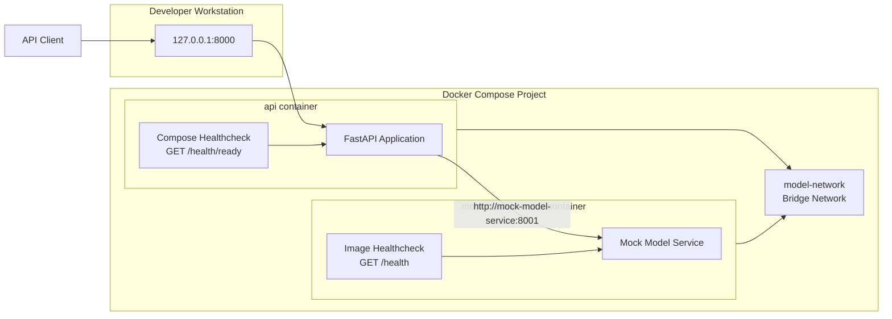

# Hardened Container Deployment

The Applied GenAI Foundation project includes a hardened Linux container image and a two-service Docker Compose environment.

The deployment provides:

- A production FastAPI API image
- A separate deterministic mock model-service image
- Multi-stage and cache-aware image builds
- Locked production dependencies
- Non-root execution
- Read-only root filesystems
- Dropped Linux capabilities
- Prevention of privilege escalation
- Ephemeral writable temporary storage
- CPU, memory, and PID guardrails
- Bounded container log files
- Docker health checks
- Dependency-aware application readiness
- Internal Compose service discovery
- Automated failure and recovery validation

## Architecture



Only the API is published to the host.

The mock model service remains accessible only through the internal Compose network.

## Container Files

| File | Purpose |
|---|---|
| `Dockerfile` | Build the production and mock-service images |
| `.dockerignore` | Exclude local, generated, and sensitive files from the build context |
| `compose.yaml` | Define the hardened two-service stack |
| `scripts/container_smoke_test.py` | Validate startup, security controls, failure behavior, and recovery |
| `tests/test_container_files.py` | Validate Dockerfile and `.dockerignore` contracts |
| `tests/test_compose_files.py` | Validate Compose security and deployment contracts |
| `tests/test_container_smoke_script.py` | Validate the automated smoke-test workflow |

## Dockerfile Targets

The Dockerfile defines reusable build and runtime stages.

| Target | Responsibility |
|---|---|
| `uv` | Supply the pinned uv binary |
| `builder` | Install locked runtime dependencies and the application package |
| `runtime` | Define the shared non-root application runtime |
| `mock` | Add the deterministic mock model-service application |
| `production` | Produce the default FastAPI API image |

### Production Image

Build the default production target:

```bash
docker build \
  --tag applied-genai-foundation:0.1.0 \
  .
```

The production image:

- Uses Python 3.12.13
- Installs dependencies from `uv.lock`
- Excludes development dependencies
- Installs the application as a non-editable package
- Does not include the test suite or local documentation
- Does not include the mock model-service script
- Runs one Uvicorn process
- Runs as UID and GID `10001`
- Uses `/health/live` for its image-level health check

### Mock Image

Build the mock target:

```bash
docker build \
  --target mock \
  --tag applied-genai-mock-model-service:0.1.0 \
  .
```

The mock target adds:

```text
scripts/mock_model_service.py
```

and runs it on port `8001`.

## Runtime Identity

Both services run as:

```text
UID: 10001
GID: 10001
```

The Dockerfile creates:

```text
appuser
appgroup
```

The Compose configuration also specifies the numeric user explicitly:

```yaml
user: "10001:10001"
```

Numeric identifiers avoid relying on user-name resolution inside the running container.

## Filesystem Controls

Both services use:

```yaml
read_only: true
```

This prevents runtime modification of the container root filesystem.

The application receives a writable ephemeral temporary filesystem:

```yaml
tmpfs:
  - /tmp:mode=1777,uid=10001,gid=10001
```

The Dockerfile configures:

```text
HOME=/tmp
TMPDIR=/tmp
```

The automated validation verifies that:

- Writing under `/app` fails
- Writing under `/tmp` succeeds
- Temporary files can be removed normally
- Both services retain UID and GID `10001`

The `/tmp` contents are ephemeral and are discarded when the container is removed.

## Linux Security Controls

Both services use:

```yaml
cap_drop:
  - ALL
```

No Linux capabilities are added back because the application does not need privileged kernel operations.

Privilege escalation is disabled through:

```yaml
security_opt:
  - no-new-privileges:true
```

The stack does not use:

```text
privileged: true
cap_add
host networking
host PID namespace
Docker socket mounts
```

## Init and Signal Handling

Both services enable:

```yaml
init: true
```

The init process:

- Runs as PID 1
- Forwards termination signals
- Reaps orphaned child processes
- Supports clean container shutdown

The Dockerfile declares:

```dockerfile
STOPSIGNAL SIGTERM
```

Both services also have:

```yaml
stop_grace_period: 10s
```

This gives Uvicorn time to complete application shutdown before forced termination.

## Resource Guardrails

The Compose limits are local development safeguards.

| Service | CPU | Memory | PID limit |
|---|---:|---:|---:|
| `api` | `1.0` CPU | `512 MiB` | `128` |
| `mock-model-service` | `0.5` CPU | `256 MiB` | `64` |

These values are not production capacity recommendations.

Production limits should be based on measured request concurrency, model latency, memory consumption, and workload behavior.

Inspect active limits:

```bash
docker inspect \
  "$(docker compose ps -q api)" \
  --format \
  'PIDs={{.HostConfig.PidsLimit}}
Memory={{.HostConfig.Memory}}
NanoCPUs={{.HostConfig.NanoCpus}}'
```

## Log Rotation

Both services use Docker's local JSON-file logging driver with bounded files:

```yaml
logging:
  driver: json-file
  options:
    max-size: "10m"
    max-file: "3"
```

This limits each service to approximately three rotating 10 MiB log files.

Application logs remain available through:

```bash
docker compose logs
docker compose logs api
docker compose logs mock-model-service
```

## Container Networking

Both services join:

```text
model-network
```

The network uses Docker's bridge driver.

The API reaches the mock model service through Compose service DNS:

```text
http://mock-model-service:8001
```

The API must not use a container IP address because container addresses can change during recreation.

The mock service uses:

```yaml
expose:
  - "8001"
```

It does not publish port `8001` to the host.

The API publishes:

```yaml
ports:
  - "127.0.0.1:8000:8000"
```

Binding to `127.0.0.1` keeps the local development API from listening on every workstation interface.

## Health Checks

The project distinguishes process liveness from dependency-aware readiness.

### Image-Level API Health

The production Docker image checks:

```text
GET /health/live
```

This determines whether the API process is running.

An unavailable model backend does not cause the image-level liveness check to fail.

### Compose API Health

The Compose stack overrides the API health check with:

```text
GET /health/ready
```

This verifies that:

- The API process is running
- The required model service is reachable
- The model service returns its expected health contract

### Mock-Service Health

The mock container checks:

```text
GET /health
```

The API startup dependency uses:

```yaml
depends_on:
  mock-model-service:
    condition: service_healthy
```

The API therefore starts only after the mock service becomes healthy.

## Dependency Failure Detection

The Compose API service uses a bounded model-service failure policy:

```yaml
APPLIED_GENAI_MODEL_SERVICE_TIMEOUT_SECONDS: "1.0"
APPLIED_GENAI_MODEL_SERVICE_RETRY_ATTEMPTS: "2"
APPLIED_GENAI_MODEL_SERVICE_RETRY_MIN_WAIT_SECONDS: "0.1"
APPLIED_GENAI_MODEL_SERVICE_RETRY_MAX_WAIT_SECONDS: "0.25"
```

These development-stack values allow readiness failures to be detected within the Compose health-check window.

They override the more general application defaults only for the Compose deployment.

## Start the Stack

Validate the configuration:

```bash
docker compose config --quiet
```

Build both images:

```bash
docker compose build --pull
```

Start the services and wait for health checks:

```bash
docker compose up \
  --detach \
  --wait \
  --wait-timeout 120 \
  --remove-orphans
```

Review service status:

```bash
docker compose ps
```

Both services should report healthy.

## Validate the API

### Liveness

```bash
curl -sS \
  http://127.0.0.1:8000/health/live
```

Expected:

```json
{
  "status": "healthy"
}
```

### Readiness

```bash
curl -sS \
  http://127.0.0.1:8000/health/ready
```

Expected:

```json
{
  "status": "ready",
  "model_service": {
    "required": true,
    "status": "healthy"
  }
}
```

### Model-Service Status

```bash
curl -sS \
  http://127.0.0.1:8000/api/v1/model-service/status
```

### Prompt Generation

```bash
curl -sS \
  -X POST \
  http://127.0.0.1:8000/api/v1/prompts/generate \
  -H "Content-Type: application/json" \
  -d '{
    "prompt": "Explain GPU memory allocation.",
    "model_id": "qwen2.5:3b",
    "temperature": 0.2,
    "max_tokens": 256
  }'
```

## Automated Smoke Test

Run the complete validation workflow:

```bash
uv run python \
  scripts/container_smoke_test.py \
  --build
```

The script validates:

1. Compose configuration and startup
2. Healthy API and mock containers
3. Read-only root filesystems
4. Writable ephemeral `/tmp`
5. Non-root UID and GID
6. Dropped Linux capabilities
7. Prevention of privilege escalation
8. Init-process configuration
9. CPU, memory, and PID limits
10. API liveness
11. Dependency-aware readiness
12. Model-service health integration
13. End-to-end prompt generation
14. Dependency failure behavior
15. Container health transition to unhealthy
16. Dependency restart and application recovery
17. Prompt generation after recovery
18. Automatic Compose cleanup

Run without rebuilding existing images:

```bash
uv run python \
  scripts/container_smoke_test.py
```

Leave the stack running for troubleshooting:

```bash
uv run python \
  scripts/container_smoke_test.py \
  --keep-running
```

Clean up afterward:

```bash
docker compose down --remove-orphans
```

## Dependency Failure Drill

The automated test performs the following sequence:

```text
Healthy API and model service
        │
        ▼
Stop mock-model-service
        │
        ├── /health/live remains HTTP 200
        ├── /health/ready becomes HTTP 503
        └── API Compose health becomes unhealthy
        │
        ▼
Restart mock-model-service
        │
        ├── Model service becomes healthy
        ├── /health/ready returns HTTP 200
        ├── API Compose health becomes healthy
        └── Prompt generation succeeds again
```

This confirms that liveness, readiness, and dependency recovery are handled separately.

## Inspect Runtime Security

Resolve the API container:

```bash
api_container="$(docker compose ps -q api)"
```

Inspect its runtime controls:

```bash
docker inspect "${api_container}" \
  --format \
  'ReadOnly={{.HostConfig.ReadonlyRootfs}}
User={{.Config.User}}
Init={{.HostConfig.Init}}
CapDrop={{json .HostConfig.CapDrop}}
SecurityOpt={{json .HostConfig.SecurityOpt}}
Pids={{.HostConfig.PidsLimit}}
Memory={{.HostConfig.Memory}}
NanoCPUs={{.HostConfig.NanoCpus}}'
```

Expected values include:

```text
ReadOnly=true
User=10001:10001
Init=true
CapDrop=["ALL"]
SecurityOpt=["no-new-privileges:true"]
Pids=128
Memory=536870912
NanoCPUs=1000000000
```

## Stop and Clean Up

Stop and remove the project containers and network:

```bash
docker compose down --remove-orphans
```

Remove the images when they are no longer required:

```bash
docker image rm \
  applied-genai-foundation:0.1.0 \
  applied-genai-mock-model-service:0.1.0
```

Remove unused build cache only when appropriate:

```bash
docker builder prune
```

Review the prune list before confirming deletion because the build cache may be shared with other local projects.

## Current Limitations

This Phase 1 container deployment is designed for local development, demonstration, and portfolio validation.

It does not yet provide:

- TLS termination
- External secret management
- Image signing
- Image vulnerability scanning
- Software bills of materials
- Registry publication
- Kubernetes manifests
- Autoscaling
- Production observability
- Distributed tracing
- GPU device assignment
- NVIDIA Container Toolkit integration
- Real Ollama, vLLM, or NVIDIA inference backends

These capabilities belong in later platform, CI/CD, GPU infrastructure, and deployment phases.