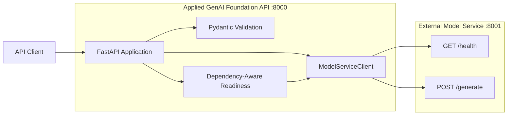

# Asynchronous Model-Service Integration

The Applied GenAI Foundation API communicates asynchronously with a separately deployed model service.

This separation allows the API layer and model-serving layer to be developed, deployed, scaled, secured, and monitored independently.

## Architecture



## Components

| Component | Responsibility |
|---|---|
| `ModelServiceClient` | Perform asynchronous upstream HTTP operations |
| `httpx2.AsyncClient` | Provide connection pooling, timeouts, and asynchronous HTTP |
| Tenacity | Apply bounded retries and exponential backoff |
| FastAPI lifespan | Create and close the shared client |
| Pydantic schemas | Validate outgoing requests and upstream responses |
| FastAPI dependencies | Inject the shared client into API routes |
| Readiness route | Determine whether required dependencies are available |
| Mock model service | Support deterministic local end-to-end testing |

## Application Lifecycle

The application creates one shared model-service client during FastAPI startup.

```text
Application startup
        │
        ▼
Create ModelServiceClient
        │
        ▼
Store client in app.state
        │
        ▼
Serve API requests
        │
        ▼
Application shutdown
        │
        ▼
Close AsyncClient and connection pool
```

Creating a shared client avoids constructing a new network connection pool for every API request.

The client is closed during application shutdown to release network resources cleanly.

## Configuration

The external service is controlled through the following environment variables:

| Variable | Default | Purpose |
|---|---|---|
| `APPLIED_GENAI_MODEL_SERVICE_BASE_URL` | `http://127.0.0.1:8001` | External model-service base URL |
| `APPLIED_GENAI_MODEL_SERVICE_HEALTH_PATH` | `/health` | Upstream health-check path |
| `APPLIED_GENAI_MODEL_SERVICE_GENERATE_PATH` | `/generate` | Upstream generation path |
| `APPLIED_GENAI_MODEL_SERVICE_REQUIRED_FOR_READINESS` | `true` | Determine whether upstream health blocks readiness |
| `APPLIED_GENAI_MODEL_SERVICE_TIMEOUT_SECONDS` | `10` | Maximum duration of one HTTP operation |
| `APPLIED_GENAI_MODEL_SERVICE_RETRY_ATTEMPTS` | `3` | Maximum number of transient-failure attempts |
| `APPLIED_GENAI_MODEL_SERVICE_RETRY_MIN_WAIT_SECONDS` | `0.25` | Minimum retry delay |
| `APPLIED_GENAI_MODEL_SERVICE_RETRY_MAX_WAIT_SECONDS` | `2` | Maximum retry delay |

The retry maximum must be greater than or equal to the retry minimum.

## Model-Service Health Flow

```text
GET /api/v1/model-service/status
        │
        ▼
ModelServiceClient.health()
        │
        ▼
GET upstream /health
        │
        ├── Valid HTTP 200 and valid schema ──► HTTP 200
        │
        ├── Transport or transient failure ───► Retry
        │
        ├── Retries exhausted ────────────────► HTTP 503
        │
        └── Invalid or unsuccessful response ─► HTTP 502
```

Expected upstream response:

```json
{
  "service": "local-mock-model-service",
  "status": "healthy"
}
```

Public API response:

```json
{
  "available": true,
  "upstream": {
    "service": "local-mock-model-service",
    "status": "healthy"
  }
}
```

## Prompt-Generation Flow

```text
POST /api/v1/prompts/generate
        │
        ▼
Validate PromptRequest
        │
        ▼
ModelServiceClient.generate()
        │
        ▼
POST upstream /generate
        │
        ▼
Validate ExternalModelGenerationResponse
        │
        ▼
Calculate total token usage
        │
        ▼
Return PromptGenerationResponse
```

Example API request:

```json
{
  "prompt": "Explain GPU memory allocation.",
  "model_id": "qwen2.5:3b",
  "temperature": 0.2,
  "max_tokens": 256,
  "stop_sequences": []
}
```

Expected upstream response contract:

```json
{
  "model_id": "qwen2.5:3b",
  "generated_text": "Generated response text.",
  "prompt_tokens": 4,
  "completion_tokens": 8,
  "finish_reason": "stop"
}
```

Public response contract:

```json
{
  "model_id": "qwen2.5:3b",
  "generated_text": "Generated response text.",
  "finish_reason": "stop",
  "usage": {
    "prompt_tokens": 4,
    "completion_tokens": 8,
    "total_tokens": 12
  }
}
```

## Retry Policy

The client retries only failures considered potentially transient.

### Retryable Conditions

- Transport and connection failures
- HTTP `408 Request Timeout`
- HTTP `429 Too Many Requests`
- HTTP `500 Internal Server Error`
- HTTP `502 Bad Gateway`
- HTTP `503 Service Unavailable`
- HTTP `504 Gateway Timeout`

### Non-Retryable Conditions

Ordinary client errors such as HTTP `400` or `404` fail immediately.

This prevents repeated requests when retrying is unlikely to succeed.

## API Error Mapping

| Client condition | Public API result |
|---|---|
| Upstream succeeds and validates | HTTP `200` |
| Request body fails Pydantic validation | HTTP `422` |
| Upstream connection or transient failures are exhausted | HTTP `503` |
| Upstream returns malformed JSON | HTTP `502` |
| Upstream response violates its Pydantic contract | HTTP `502` |
| Upstream returns a non-transient unsuccessful status | HTTP `502` |

The public API does not expose internal exception details or upstream response bodies.

## Liveness and Readiness

### Liveness

```text
GET /health/live
```

Liveness checks only whether the API process is operating.

It does not contact the model service.

Expected response:

```json
{
  "status": "healthy"
}
```

### Readiness with a Required Model Service

When:

```dotenv
APPLIED_GENAI_MODEL_SERVICE_REQUIRED_FOR_READINESS=true
```

the API contacts the model service before reporting readiness.

Healthy response:

```json
{
  "status": "ready",
  "model_service": {
    "required": true,
    "status": "healthy"
  }
}
```

Unavailable dependency:

```json
{
  "status": "not_ready",
  "model_service": {
    "required": true,
    "status": "unavailable"
  }
}
```

The unavailable response uses HTTP `503`.

### Readiness with an Optional Model Service

When:

```dotenv
APPLIED_GENAI_MODEL_SERVICE_REQUIRED_FOR_READINESS=false
```

the API can report readiness without contacting the model service:

```json
{
  "status": "ready",
  "model_service": {
    "required": false,
    "status": "not_required"
  }
}
```

The dedicated model-service status and generation endpoints continue to reflect the model service's actual availability.

## Local End-to-End Test

### Terminal 1 — Mock Model Service

From `phase-01-foundation`:

```bash
uv run uvicorn scripts.mock_model_service:app \
  --host 127.0.0.1 \
  --port 8001
```

### Terminal 2 — Main API

```bash
uv run uvicorn applied_genai.main:app \
  --host 127.0.0.1 \
  --port 8000 \
  --reload
```

### Terminal 3 — Verify Readiness

```bash
curl -s http://127.0.0.1:8000/health/ready
```

### Verify Model-Service Status

```bash
curl -s \
  http://127.0.0.1:8000/api/v1/model-service/status
```

### Generate a Mock Response

```bash
curl -s \
  -X POST \
  http://127.0.0.1:8000/api/v1/prompts/generate \
  -H "Content-Type: application/json" \
  -d '{
    "prompt": "Explain GPU memory allocation.",
    "model_id": "qwen2.5:3b",
    "temperature": 0.2,
    "max_tokens": 256
  }'
```

The mock service uses whitespace-based word counts for its token fields. These are deterministic test values, not results from a production model tokenizer.

## Failure Drill

Stop the mock model service while leaving the main API running.

Liveness should continue succeeding:

```bash
curl -i http://127.0.0.1:8000/health/live
```

Readiness should return HTTP `503` when the model service is required:

```bash
curl -i http://127.0.0.1:8000/health/ready
```

The model-service status endpoint should also return HTTP `503`:

```bash
curl -i \
  http://127.0.0.1:8000/api/v1/model-service/status
```

Prompt generation should return HTTP `503`:

```bash
curl -i \
  -X POST \
  http://127.0.0.1:8000/api/v1/prompts/generate \
  -H "Content-Type: application/json" \
  -d '{"prompt":"Test unavailable upstream behavior."}'
```

## Current Limitations

The Commit 5 client currently provides:

- Non-streaming prompt generation
- JSON request and response contracts
- One configured model-service endpoint
- Process-local retry handling
- Basic upstream health validation
- Deterministic mock-service testing

Later phases can add:

- Streaming token responses
- Authentication and API credentials
- Multiple model backends
- Circuit breaking
- Request correlation identifiers
- Metrics and distributed tracing
- Real Ollama or vLLM adapters
- Model discovery
- Rate limiting and concurrency control